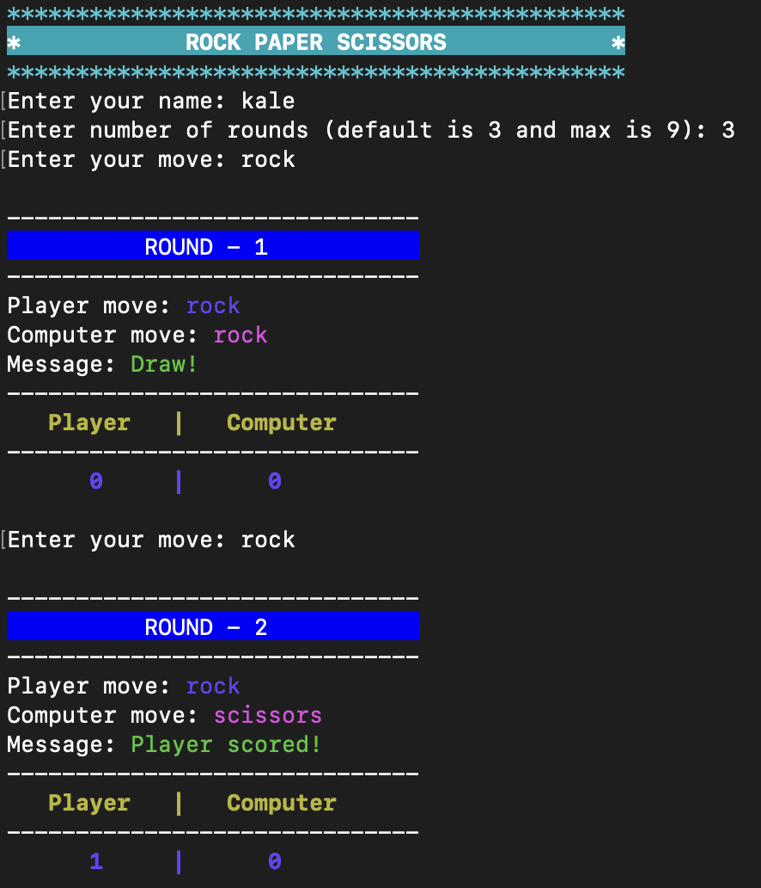

## Rock, Paper and Scissors - OOP JavaScript

A popular Rock, Paper and Scissors game built using JavaScript and OOP approach.

- It is console app using Node.js.
- Allows user to play against computer.

### Install and run the game

```
git clone [repo]

cd rock-paper-scissors
npm i

node app.js
```

### Game Play


